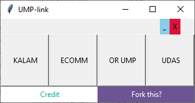
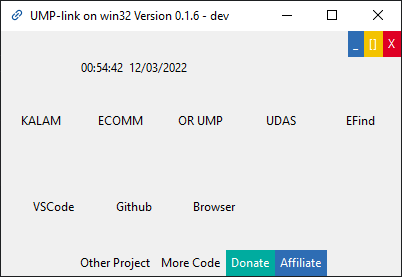
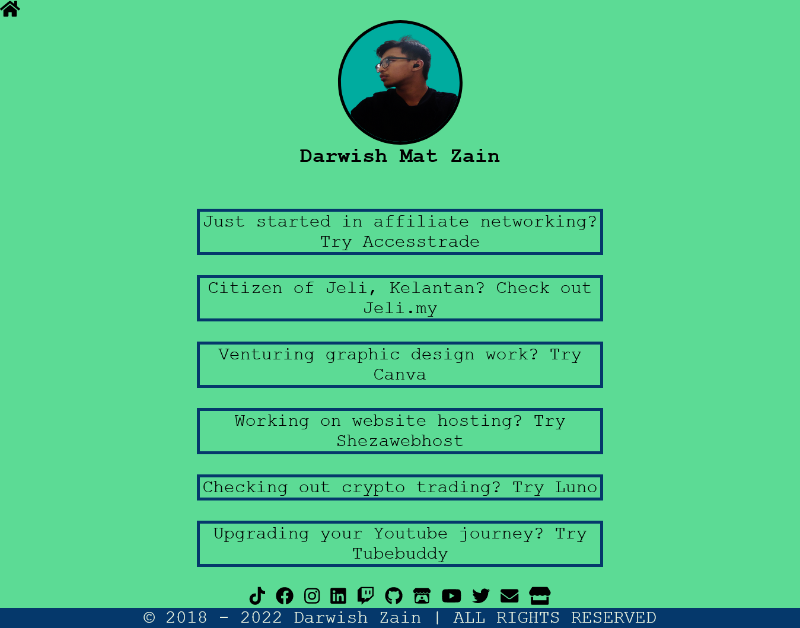

# UMP-link ... currently known as [Recluse Board](https://github.com/darwishzain/recluse-board)
[](https://sourceforge.net/projects/ump-link/files/latest/download)

[](https://sourceforge.net/projects/ump-link/files/latest/download)

##### UMP-linkv0.1.5


### Introduction
You are a studying at University of Malaysia Pahang (UMP) and you need to access certain UMP's website for an urgent matter. What would you do ?

By using our solution, you can access the website with a click of a button and it will automatically open a browser to access the website.

### Intended Use
1. User setup ```UMP-link``` as a startup application.
2. ```UMP-link``` run on startup.
3. User click on desired website.

### Getting Started
#### Installation (Windows)
##### ZIP
1. Download application ```.zip``` file from [here](https://github.com/darwishzain/ump-link/releases/download/neo-release/UMP-Link.v0.1.5.zip).
2. Extract ```.zip``` file.
3. Open folder ```./UMP-link.vx.x.x/ump-link```.
4. Open file ```ump-link.exe```.

### Devlog
* **Version 0.1.5**
  - 

  - added link for UMP KALAM website ```https://kalam.ump.edu.my```
  - added link for UMP ECommunity website ```https://community.ump.edu.my```
  - added link for UMP Open Registration website ```https://or.ump.edu.my```
  - added link for UMP Digital Assessment System website ```https://udas.ump.edu.my```


* **Version 0.1.6**
  - 
  - added link for developerr's affiliate links. (Using the link to access any of the service listed there as seen below might help developers in some way) ```https://darwishzain.com/link.php``` 
  - added link for UMP Library (EFind) website ```https://efind.ump.edu.my```
  - added link for users to make donation to support the project ```https://ko-fi/darwishzain```
  - Added button for starting Visual Studio Code
  - Added button for starting Github Desktop
  - Added button for starting Browser
  - Added a working digital clock ```HH:MM:SS``` and date ```DD/MM/YY```
  - Added button to close application ```Working```, maximize ```Not Working``` and minimize ```Not Working```
